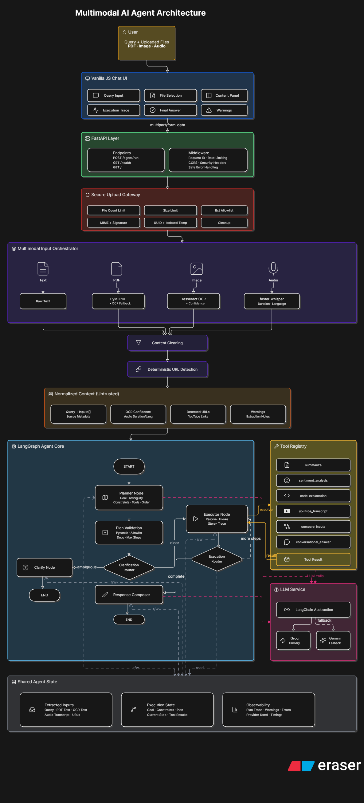

# Multimodal Agentic AI Application

A production-oriented multimodal AI agent that processes text, PDFs, images, audio files, and validated YouTube URLs; converts heterogeneous inputs into normalized context; creates constrained multi-step execution plans; executes allowlisted tools through a LangGraph workflow; and returns grounded answers with safe execution traces.

The project demonstrates practical Generative AI engineering beyond a basic chatbot: multimodal preprocessing, structured LLM planning, semantic plan validation and repair, deterministic tool execution, prompt-injection boundaries, provider fallback, Docker packaging, automated testing, and public deployment.

## Live Demo

**Public Application:** `https://multimodal-agent-dv2h.onrender.com`

**Health Endpoint:** `https://multimodal-agent-dv2h.onrender.com/health`

> The application is hosted on a Render free-tier instance. The first request after inactivity may take additional time while the service wakes up.

## Project Highlights

- Multimodal input processing for text, PDFs, images, audio, and YouTube URLs.
- PyMuPDF extraction with OCR support for scanned document content.
- Tesseract OCR for image inputs.
- Local audio transcription using faster-whisper.
- Deterministic YouTube URL detection and transcript retrieval.
- Structured LLM planner with application-owned tool and input-reference contracts.
- Custom LangGraph workflow with explicit nodes, routing, and bounded execution.
- Six allowlisted agent tools behind a Tool Registry.
- Multi-step tool chaining using validated previous-step outputs.
- Cross-input reasoning across multiple uploaded sources.
- Mandatory clarification flow for ambiguous requests.
- Pydantic schema validation and semantic plan validation.
- Bounded repair of schema-valid but semantically invalid plans.
- Groq primary LLM provider with Gemini fallback.
- Prompt-injection boundaries around extracted multimodal content.
- Deterministic executor-owned tool input resolution.
- Safe execution traces without raw extracted content or provider exceptions.
- FastAPI backend and responsive HTML/CSS/Vanilla JavaScript frontend.
- Dockerized runtime with Tesseract and FFmpeg.
- Public deployment on Render.
- Automated unit and integration test coverage.

## Supported Inputs

| Input | Processing Pipeline |
|---|---|
| Text Query | Query normalization and constrained agent planning |
| PDF | PyMuPDF text extraction with OCR support where required |
| Image | Tesseract OCR |
| Audio | faster-whisper transcription |
| Multiple Files | Independent extraction with source-aware reasoning |
| YouTube URL | Deterministic URL validation and transcript retrieval |

## Architecture



Detailed architecture documentation is available in `docs/architecture.md`.

### High-Level Request Flow

```text
Browser / API Client
        |
        v
FastAPI API Boundary
        |
        v
Secure Upload Processing + Request Validation
        |
        v
Multimodal Preprocessing
  |         |          |             |
 PDF      Image      Audio      YouTube URL
  |         |          |             |
PyMuPDF  Tesseract  faster-whisper  URL Detection
  |         |          |             |
  +---------+----------+-------------+
                    |
                    v
             NormalizedContext
                    |
                    v
                 Planner
          Groq Primary / Gemini Fallback
                    |
                    v
          Structured Output Validation
                    |
                    v
           Semantic Plan Validation
                    |
                    v
          Bounded Plan Repair Attempt
                    |
                    v
             LangGraph Workflow
                    |
                    v
                  Executor
                    |
                    v
        Deterministic Input Resolution
                    |
                    v
               Tool Registry
                    |
                    v
              Tool Execution
                    |
                    v
             Response Composer
                    |
                    v
      Final Answer + Safe Execution Trace
```

## How the Agent Works

### 1. Request Processing

The FastAPI API boundary validates incoming requests, applies upload constraints, assigns request-level context, and forwards accepted inputs to deterministic preprocessing.

### 2. Multimodal Extraction

Each supported modality has an application-owned extraction path.

- PDFs are processed using PyMuPDF.
- Image content is processed using Tesseract OCR.
- Audio files are transcribed using faster-whisper.
- YouTube URLs are detected and validated before planner execution.

Extracted inputs remain separated by stable source identifiers.

### 3. Context Normalization

Preprocessed content is converted into a `NormalizedContext` containing the user query, extracted inputs, validated URLs, and source metadata required by downstream components.

The planner reasons over normalized context instead of raw HTTP uploads.

### 4. Constrained Planning

The LLM planner converts the user's request into a structured `PlannerOutput`.

The planner receives:

- Trusted application policy.
- An application-owned tool allowlist.
- Explicit input-reference contracts.
- The user's request.
- Validated URL metadata.
- Delimited extracted content treated as untrusted data.

The planner selects tools but never executes them directly.

### 5. Plan Validation and Repair

Planner output passes through two validation layers.

**Structural validation** uses Pydantic models to enforce the planner output contract.

**Semantic validation** verifies the plan against the current runtime context, including source references, detected URLs, step dependencies, ordering constraints, and execution limits.

A bounded repair attempt can correct schema-valid but semantically invalid plans without introducing unrestricted agent loops.

### 6. LangGraph Orchestration

LangGraph coordinates the explicit workflow:

```text
Planner
   |
   v
Plan Validation
   |
   +---- Clarification Required ----> Clarification Response
   |
   v
Executor
   |
   +---- More Steps ----> Executor
   |
   v
Response Composer
   |
   v
Final Response
```

LangGraph is used for controlled workflow orchestration rather than unrestricted agent autonomy.

### 7. Deterministic Tool Execution

The executor processes one validated plan step at a time.

The planner does not generate arbitrary runtime arguments. Instead, each plan step contains a constrained `InputReference`:

- `source`
- `sources`
- `all_sources`
- `step_output`
- `detected_urls`
- `query_context`

The executor deterministically resolves the reference against application-owned runtime state and creates a `ToolInput`.

### 8. Response Composition

The response composer converts completed workflow state into a user-facing answer.

The API response includes the final answer and safe observability information without exposing raw extracted content, secrets, hidden reasoning, or provider exceptions.

## LangGraph Workflow

The custom LangGraph workflow contains explicit application-owned nodes:

- `planner_node`
- `plan_validation_node`
- `clarify_node`
- `executor_node`
- `response_composer_node`

Routing is controlled by deterministic application logic.

The workflow supports:

- Clarification before execution.
- Multi-step execution.
- Step dependencies.
- Previous-step output references.
- Controlled tool failures.
- Maximum execution-step limits.
- Final response composition.

## Tool Registry

The Tool Registry is the authoritative runtime mapping between allowlisted `ToolName` values and tool implementations.

| Tool | Responsibility |
|---|---|
| `summarize` | Produce concise summaries from resolved text |
| `sentiment_analysis` | Analyze sentiment, tone, and polarity |
| `code_explanation` | Explain code, identify issues, and discuss complexity |
| `youtube_transcript` | Retrieve transcripts from validated YouTube URLs |
| `compare_inputs` | Compare multiple extracted inputs |
| `conversational_answer` | Answer context-aware requests when no specialized tool is appropriate |

Unknown or arbitrary tool names cannot be executed.

## Multi-Step Agent Example

A YouTube summarization request can produce:

```text
User Request
    |
    v
Step 1: youtube_transcript
Input: detected_urls
    |
    v
Transcript
    |
    v
Step 2: summarize
Input: step_output(step1)
Dependency: step1
    |
    v
Final Summary
```

A cross-input comparison request can produce:

```text
PDF ------------------+
                      |
                      v
                  compare_inputs
                      |
                      v
Audio Transcript -----+
                      |
                      v
              Comparative Analysis
```

## LLM Provider Strategy

The application uses a provider abstraction instead of coupling workflow logic directly to one LLM SDK.

```text
LLM Service
    |
    +---- Primary Provider: Groq
    |
    +---- Fallback Provider: Gemini
```

Groq is the primary provider.

Gemini is used as a fallback when the primary provider is unavailable or generation fails.

Provider-specific behavior remains behind a common application contract.

Structured outputs are validated using application-owned Pydantic models before entering the execution workflow.

## Security Design

Security boundaries are explicit parts of the architecture.

### Prompt-Injection Boundary

Extracted PDF content, OCR output, audio transcripts, and other uploaded content are treated as untrusted data.

Instructions found inside extracted content cannot:

- Override planner policy.
- Change the user's actual request.
- Add tools.
- Modify tool behavior.
- Request arbitrary code execution.
- Request shell execution.
- Enable unrestricted URL fetching.

### Tool Allowlisting

Only application-owned `ToolName` values registered in the Tool Registry can execute.

The system does not provide arbitrary shell access, generic web search, unrestricted code execution, or unrestricted URL fetching.

### Structured Input References

The planner references runtime data through constrained `InputReference` values instead of constructing arbitrary tool arguments.

The executor owns final input resolution.

### Upload Processing

Uploads are validated against supported types and application limits.

Temporary processing files are cleaned after request processing and excluded from source control.

### Secret Management

API keys are loaded through environment variables.

Secrets are excluded from:

- Git.
- Docker images.
- User-facing responses.
- Safe execution traces.

### Safe Observability

Execution traces expose useful workflow metadata such as stages, selected tools, statuses, step IDs, and controlled error codes.

Raw extracted content, secrets, hidden reasoning, and provider exceptions are intentionally excluded.

## Tech Stack

### Backend and Agent Runtime

- Python 3.12
- FastAPI
- Uvicorn
- Pydantic v2
- LangGraph
- Selective LangChain components

### LLM Providers

- Groq — primary provider
- Gemini — fallback provider

### Multimodal Processing

- PyMuPDF
- Tesseract OCR
- pytesseract
- Pillow
- faster-whisper
- FFmpeg
- youtube-transcript-api

### Frontend

- HTML
- CSS
- Vanilla JavaScript

### Testing and Deployment

- pytest
- pytest-asyncio
- Docker
- Render

## Project Structure

```text
multimodal-agent/
|
|-- app/
|   |-- agent/          # Planner, schemas, validation, graph, executor
|   |-- api/            # FastAPI routes and dependencies
|   |-- extraction/     # Multimodal extraction pipeline
|   |-- llm/            # Provider abstraction, Groq, Gemini, fallback
|   |-- models/         # Application data models
|   |-- services/       # Application orchestration services
|   |-- tools/          # Six allowlisted agent tools and registry
|   |-- utils/          # Shared deterministic utilities
|   `-- main.py         # FastAPI application entry point
|
|-- static/             # Browser UI
|-- tests/              # Unit and integration tests
|-- docs/
|   |-- architecture.md
|   `-- architecture.png
|
|-- Dockerfile
|-- render.yaml
|-- requirements.txt
|-- .env.example
`-- README.md
```

## Local Setup

### Prerequisites

Install:

- Python 3.12
- Tesseract OCR
- FFmpeg
- Git

### 1. Clone the Repository

```bash
git clone <YOUR_REPOSITORY_URL>
cd multimodal-agent
```

### 2. Create a Virtual Environment

```bash
python -m venv .venv
```

Activate it.

Windows PowerShell:

```powershell
.venv\Scripts\Activate.ps1
```

Linux/macOS:

```bash
source .venv/bin/activate
```

### 3. Install Dependencies

```bash
pip install --upgrade pip
pip install -r requirements.txt
```

### 4. Configure Environment Variables

Create `.env` from `.env.example`.

```bash
cp .env.example .env
```

On Windows PowerShell:

```powershell
Copy-Item .env.example .env
```

Add your provider API keys to `.env`.

Never commit `.env`.

### 5. Start the Application

```bash
uvicorn app.main:app --reload
```

Open:

```text
http://localhost:8000
```

Health endpoint:

```text
http://localhost:8000/health
```

## Environment Variables

| Variable | Purpose | Required |
|---|---|---|
| `GROQ_API_KEY` | Primary LLM provider credential | Yes |
| `GEMINI_API_KEY` | Fallback LLM provider credential | Recommended |
| `APP_ENV` | Application environment | No |
| `DEBUG` | Debug configuration | No |
| `LOG_LEVEL` | Application log level | No |
| `PORT` | Runtime HTTP port, supplied by Render in deployment | No |

Additional runtime limits and model settings are defined by the application settings contract and may be configured through environment variables where supported.

## Running Tests

Run the complete test suite:

```bash
pytest -q
```

Run focused planner tests:

```bash
pytest tests/unit/test_planner.py tests/unit/test_planner_scenarios.py -q
```

Run plan-validation tests:

```bash
pytest tests/unit/test_plan_validation.py -q
```

Run executor tests:

```bash
pytest tests/unit/test_executor.py -q
```

## Docker

The Docker image includes:

- Python runtime.
- Application dependencies.
- Tesseract OCR.
- FFmpeg.
- Required native runtime libraries.
- FastAPI application.
- Static frontend.

### Build

```bash
docker build -t multimodal-agent:local .
```

### Run

```bash
docker run --name multimodal-agent-local \
  --env-file .env \
  -p 8000:8000 \
  multimodal-agent:local
```

Windows PowerShell:

```powershell
docker run --name multimodal-agent-local `
  --env-file .env `
  -p 8000:8000 `
  multimodal-agent:local
```

### Verify Container Health

```bash
curl http://localhost:8000/health
```

## Deployment

The application is publicly deployed as a Docker Web Service on Render.

Deployment flow:

```text
GitHub Repository
        |
        v
Render Docker Build
        |
        v
Container Image
        |
        v
Render Web Service
        |
        +---- Environment Secrets
        |
        +---- Public HTTPS Endpoint
        |
        `---- /health
```

The deployment configuration:

- Builds from the repository Dockerfile.
- Installs Tesseract and FFmpeg inside the image.
- Runs the application as a non-root user.
- Reads API keys from Render environment secrets.
- Binds Uvicorn to `0.0.0.0`.
- Uses Render's runtime `PORT`.
- Exposes `/health` for deployment verification.

## API Usage

### Health Check

```http
GET /health
```

Example response:

```json
{
  "status": "healthy"
}
```

### Execute Agent Request

```http
POST /agent/run
```

The endpoint accepts the user query together with supported uploaded files and URLs according to the application's request contract.

Example conceptual response:

```json
{
  "final_answer": "Generated answer based on validated tool execution.",
  "trace": [
    {
      "stage": "executor",
      "status": "completed",
      "step_id": "step1",
      "tool_name": "summarize"
    }
  ]
}
```

## Acceptance Test Cases

The deployed application was verified against representative multimodal workflows.

### Test Case 1 — Text-Only Conversational Request

**Input:** Text query without uploaded files.

**Expected behavior:**

```text
query_context
      |
      v
conversational_answer
      |
      v
Final Answer
```

### Test Case 2 — PDF Processing

**Input:** PDF document with a document-specific request.

**Expected behavior:**

- Extract PDF content.
- Preserve source identity.
- Select the appropriate specialized tool.
- Execute the validated plan.
- Return a grounded final answer and safe trace.

### Test Case 3 — Clarification Flow

**Input:** Ambiguous request without enough information to create a meaningful execution plan.

**Expected behavior:**

- Planner marks clarification as required.
- No executable steps are returned.
- Workflow routes to the clarification node.
- User receives a clarification question.

### Test Case 4 — YouTube Summarization

**Input:** Validated YouTube URL with a summarization request.

**Expected plan:**

```text
youtube_transcript
        |
        v
    summarize
        |
        v
   Final Answer
```

### Test Case 5 — Cross-Input Comparison

**Input:** PDF document and audio file.

**Expected behavior:**

- Extract PDF content.
- Transcribe audio.
- Preserve both source identifiers.
- Select `compare_inputs`.
- Resolve both inputs deterministically.
- Compare the actual extracted contents.
- Return a grounded comparative answer.

## Design Decisions

### Why LangGraph?

The project requires explicit control over planning, validation, clarification, execution, dependencies, failure handling, and response composition.

LangGraph provides stateful orchestration while allowing routing decisions to remain application-owned and testable.

### Why Not a Fully Autonomous Agent?

Unrestricted agents increase the risk of arbitrary tool selection, prompt injection, uncontrolled loops, and difficult-to-debug execution.

This project uses constrained autonomy:

```text
LLM proposes a plan
        |
        v
Application validates the plan
        |
        v
Application resolves inputs
        |
        v
Allowlisted tools execute
```

### Why Deterministic Preprocessing?

PDF extraction, OCR, audio transcription, URL detection, and upload validation do not require LLM reasoning.

Keeping these operations deterministic reduces cost, latency, and attack surface.

### Why Structured Input References?

Allowing an LLM to generate arbitrary tool arguments would weaken the trust boundary.

Structured references keep runtime data resolution under application control.

### Why Groq + Gemini Fallback?

The provider abstraction reduces dependence on a single LLM service.

Groq provides the primary inference path, while Gemini provides fallback capability when the primary provider is unavailable or fails.

### Why Vanilla JavaScript?

The assessment UI is intentionally lightweight.

HTML, CSS, and Vanilla JavaScript keep the frontend easy to inspect, deploy, and maintain while preserving focus on backend agent architecture.

## Limitations

- Provider-level malformed structured output can fail before semantic plan repair is available.
- YouTube transcript retrieval depends on transcript availability and external API behavior.
- Free-tier Render instances can experience cold starts after inactivity.
- Audio transcription is computationally expensive on limited cloud instances.
- OCR quality depends on document resolution and layout.
- Large media requests are constrained by configured upload and processing limits.
- The application does not support unrestricted web browsing, arbitrary URL fetching, shell execution, or arbitrary code execution.
- Workflow state is request-scoped and is not persisted across service restarts.

## Future Improvements

- Add bounded retries for provider-level structured-output failures.
- Add stronger tool/input-reference compatibility validation.
- Add CI/CD workflows for automated tests and deployment verification.
- Add persistent LangGraph checkpoints where appropriate.
- Add streaming workflow progress to the frontend.
- Add background jobs for long-running audio and document processing.
- Add authentication and per-user rate limiting.
- Add production metrics, tracing, and alerting.
- Add stronger file malware scanning and content-security controls.
- Add configurable model routing based on task type and provider health.


## Engineering Scope

This project was built as a time-constrained Generative AI engineering assessment.

The implementation prioritizes:

- Explicit system boundaries.
- Testable agent orchestration.
- Controlled LLM behavior.
- Multimodal processing.
- Secure tool execution.
- Provider resilience.
- Deployment reproducibility.
- Practical observability.

The result is a constrained multimodal agent architecture designed to demonstrate production-oriented Generative AI engineering decisions rather than only prompt-based chatbot behavior.